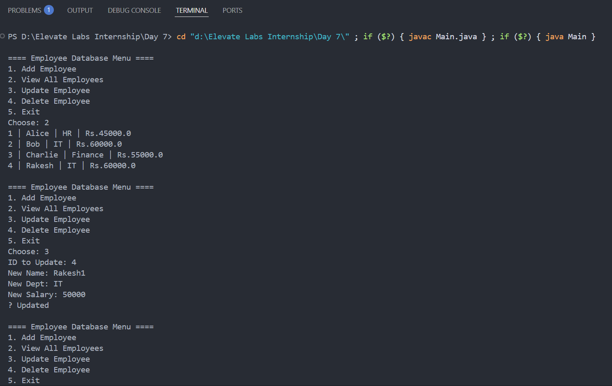

# 🗃️ Employee Database Management System (JDBC + MySQL)

**Task 7 – Elevate Labs Java Developer Internship**

A console-based Java application that performs full CRUD operations (Create, Read, Update, Delete) on employee data using **JDBC and MySQL**. This project demonstrates practical use of Java backend development, database connectivity, and JDBC API features.

---

## 🚀 Features

- ➕ Add new employees to the database  
- 📋 View all employee records  
- ✏️ Update existing employee details  
- 🗑️ Delete employee by ID  
- ❌ Graceful error handling  
- 🧵 Uses PreparedStatement to prevent SQL injection

---

## 🧰 Technologies Used

- ☕ Java  
- 🐬 MySQL  
- 🔗 JDBC (Java Database Connectivity)  
- 📦 JDBC Driver: `mysql-connector-j`  
- 🛠️ IDE: Eclipse / IntelliJ IDEA  

---

## 🧱 Project Structure

```

EmployeeApp/
│
├── DBConnect.java          // Handles database connection
├── Employee.java           // POJO class for employee model
├── EmployeeDAO.java        // JDBC CRUD logic (DAO layer)
├── Main.java               // Menu-driven user interface
├── Interview\_Questions.txt // Q\&A for JDBC interview prep
├── Screenshot.png          // (Optional) proof of task completion
└── README.md               // This file

````

---

## 🏁 How to Run

### ✅ 1. Setup Database
Create a MySQL database and table:

```sql
CREATE DATABASE employee_db;

USE employee_db;

CREATE TABLE employees (
    id INT PRIMARY KEY AUTO_INCREMENT,
    name VARCHAR(100),
    department VARCHAR(100),
    salary DOUBLE
);
````

### ✅ 2. Configure JDBC

Update your `DBConnect.java` file with your DB credentials:

```java
String url = "jdbc:mysql://localhost:3306/employee_db";
String user = "root";
String password = "yourpassword";
```

### ✅ 3. Add MySQL JDBC Driver

* If using Eclipse: Add `mysql-connector-java.jar` to project build path
* If using Maven: Add to `pom.xml`

```xml
<dependency>
  <groupId>mysql</groupId>
  <artifactId>mysql-connector-java</artifactId>
  <version>8.0.33</version>
</dependency>
```

### ✅ 4. Run the App

Compile and run `Main.java`. Use the console menu to add, view, update, or delete employees.

---

## 📷 Screenshot



---

## 📄 Interview Q\&A

Refer to [`Interview_Question_Answers.txt`](Interview_Question_Answers.txt) for common JDBC questions and answers useful for placements and interviews.

---

## 🎯 Learning Outcome

✅ Learn how to:

* Connect Java with MySQL using JDBC
* Write clean, reusable DAO-layer code
* Use PreparedStatement for secure input
* Perform CRUD operations with real-time console interaction
